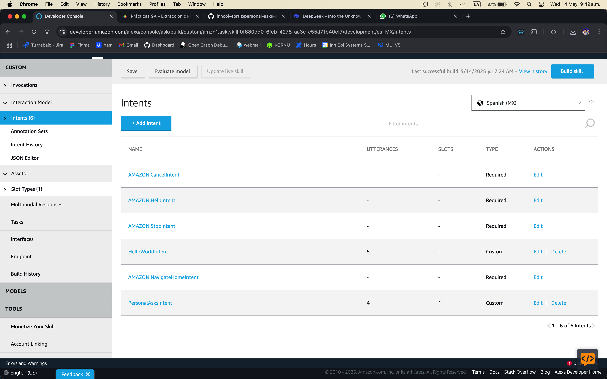
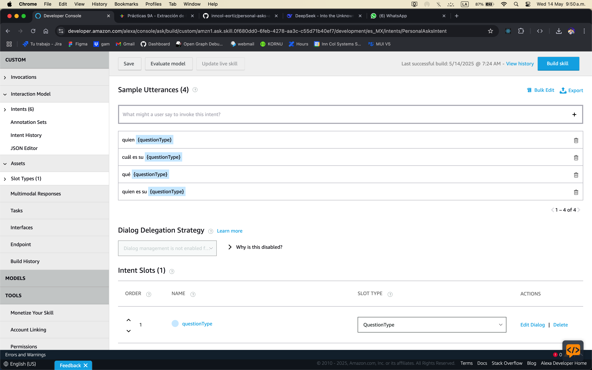
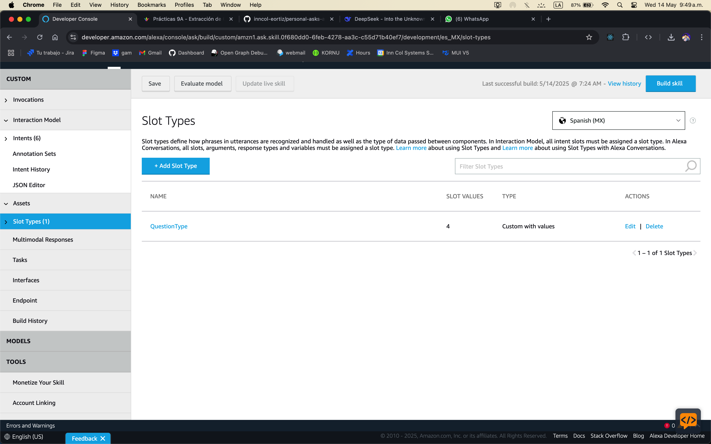
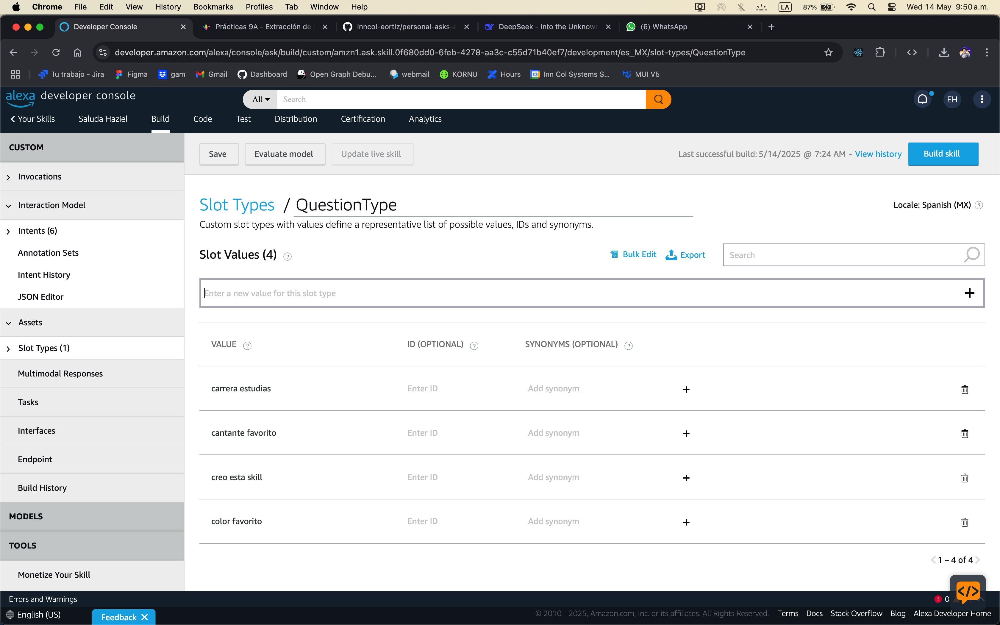
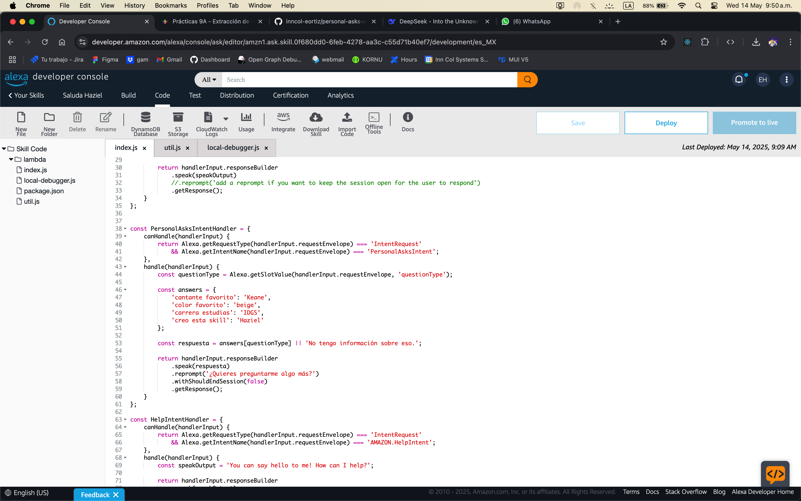

  

    
    
  

# Saluda Haziel - Alexa Skill

## Descripción
Saluda Haziel es una skill para Amazon Alexa creada por Eli Haziel Ortiz Ramirez en la Universidad Tecnológica de Xicotepec de Juárez (Puebla). Esta skill permite interactuar con el asistente virtual para obtener respuestas personalizadas sobre preferencias e información del creador.

## Funcionalidades

### Intents Principales
- **LaunchRequest**: Mensaje de bienvenida cuando se inicia la skill
- **HelloWorldIntent**: Responde con un saludo personalizado
- **PersonalAsksIntent**: Responde preguntas sobre preferencias personales del desarrollador

### Preguntas Disponibles
Puedes preguntar sobre los siguientes temas:
- Cantante favorito
- Color favorito
- Carrera que estudia el desarrollador
- Quién creó esta skill

## Cómo Usar

1. Inicia la skill diciendo: "Alexa, abre Saluda Haziel"
2. Para hacer preguntas personales: "¿Cuál es tu [tipo de pregunta]?"
   - Ejemplo: "¿Cuál es tu cantante favorito?"
   - Ejemplo: "¿Qué carrera estudias?"

## Comandos Útiles
- "Ayuda": Obtener información sobre cómo usar la skill
- "Detener" o "Cancelar": Finalizar la conversación con la skill

## Información Técnica
La skill está desarrollada utilizando:
- Node.js
- Alexa Skills Kit (ASK) SDK v2
- AWS Lambda

## Documentación del Proceso

Luego de tener creada la skill básica de saludo, se llevo a cabo lo siguiente.

#### Creación del Nuevo Intent
El nuevo intent que maneja las preguntas fue llamado `PersonalAsksIntent`

#### Asignar las opciones a responder en el nuevo intent
Para que Alexa pueda responder a las preguntas, se usó un slot para poder definir las preguntas dinamicas pero con respuestas estaticas en el handler.

#### Nuevo Slot
Se utilizo un slot con valores que pertenecen a cada una de las posibles preguntas para que el handler pueda responder de forma dinámica

### Valores del Slot
Se implemento cada posible valor del slot

### Handler del Intent

El nuevo intent fue manejado en otro handler el cual mediante un Object Literal, evalua que valor del slot coincide con los valores del objeto literal y si coincide retorna la respuesta de la derecha y en caso de no coincidir con ninguno, retorna el valor por defecto.

## Desarrollador
**Nombre**: Eli Haziel Ortiz Ramirez  
**Institución**: Universidad Tecnológica de Xicotepec de Juárez, Puebla  
**Carrera**: IDGS (Ingeniería en Desarrollo y Gestión de Software)

## Licencia
© 2023 Eli Haziel Ortiz Ramirez - Todos los derechos reservados
